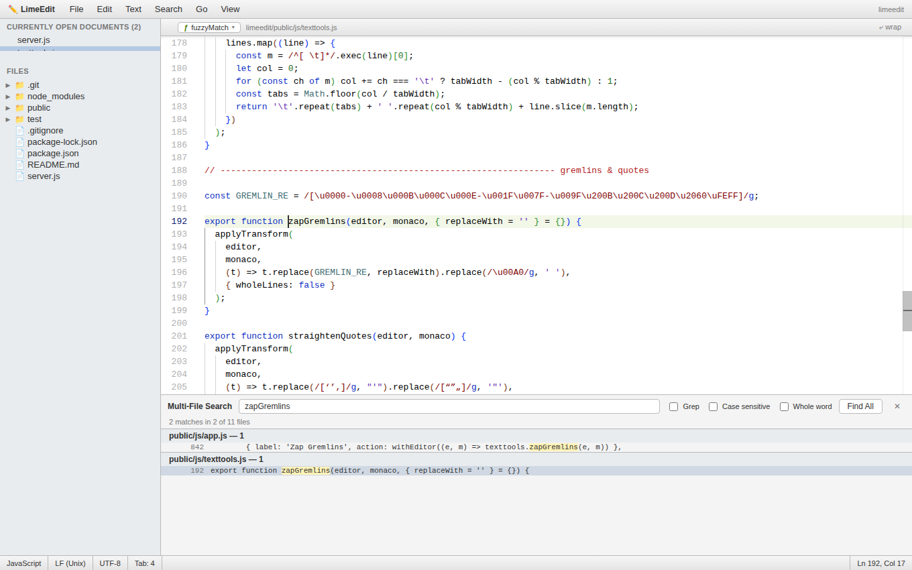
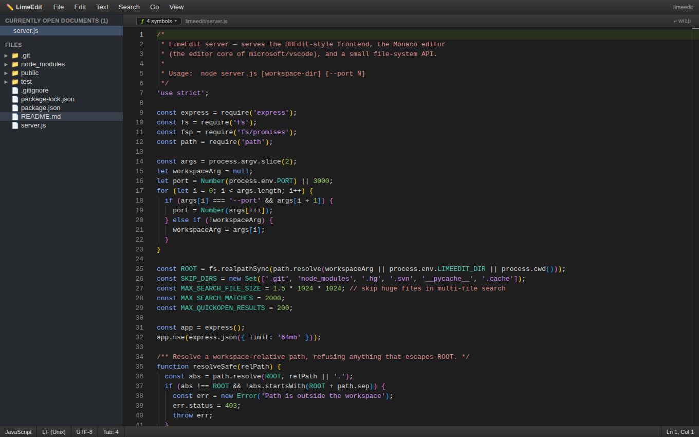

# LimeEdit ✏️

**A BBEdit-style text editor with the power of Visual Studio Code.**

LimeEdit recreates the classic [BBEdit](https://www.barebones.com/products/bbedit/)
experience — the sidebar of currently open documents, the Text menu full of
transformations, multi-file grep search, the function popup, the status bar —
on top of [Monaco](https://github.com/microsoft/monaco-editor), the editor
core built from the [microsoft/vscode](https://github.com/microsoft/vscode)
source tree. BBEdit's ergonomics, VS Code's engine.

*It still doesn't suck.®*





## Quick start

```sh
npm install
npm start [path-to-workspace]     # defaults to the current directory
# → http://localhost:3000
```

`PORT=8080 npm start` or `node server.js ~/projects/site --port 8080` also work.

## What you get

**From the vscode editor core (Monaco):**

- Syntax highlighting for ~80 languages, with IntelliSense for
  JavaScript/TypeScript, CSS, HTML and JSON
- Multiple cursors, column selection, bracket-pair colorization
- In-document Find & Replace with regex (`⌘F` / `⌥⌘F`)
- The Command Palette (`F1`)
- Full undo/redo, code folding, auto-indent

**From the BBEdit playbook:**

| Feature | Where |
| --- | --- |
| Currently Open Documents sidebar with dirty-dots | left sidebar |
| Disk browser | left sidebar |
| Function popup (jump to function/class/heading) | navigation bar, `ƒ` |
| Multi-File Search with Grep, case & whole-word options | Search ▸ Multi-File Search… (`⇧⌘F`) |
| Change Case (UPPER / lower / Title / Sentence / tOGGLE) | Text menu |
| Sort Lines… (descending, case-sensitive, delete duplicates) | Text menu |
| Reverse Lines, Process Duplicate Lines, Delete Blank Lines | Text menu |
| Prefix/Suffix Lines…, Add/Remove Line Numbers | Text menu |
| Entab / Detab, Strip Trailing Whitespace | Text menu |
| Zap Gremlins (control & zero-width characters) | Text menu |
| Educate / Straighten Quotes | Text menu |
| Hard Wrap… | Text menu |
| Open Quickly (fuzzy file search) | `⌘P` |
| Soft-wrap toggle, Show Invisibles | View menu / navigation bar |
| Line-ending (LF/CRLF), language mode & tab-width switchers | status bar |
| Light & dark chrome | View ▸ Dark Mode |

Text transformations follow BBEdit's rule: they apply to the **selection** if
there is one, otherwise to the **entire document**, and every one of them is
undoable.

## Architecture

```
server.js            Express server: static frontend, Monaco assets,
                     and a small file API (tree/read/write/search/quick-open),
                     sandboxed to the workspace root
public/
  index.html         Menu bar · sidebar · navigation bar · editor · status bar
  css/limeedit.css   BBEdit-style chrome, light + dark
  js/app.js          Documents, menus, dialogs, search, quick open, status bar
  js/texttools.js    The Text menu transformations
  js/functionscanner.js  Regex scanners feeding the function popup
```

There is no build step. Monaco ships prebuilt in the `monaco-editor` npm
package (built from `microsoft/vscode`) and is served as-is from
`node_modules/monaco-editor/min/vs`.

## Tests

```sh
npm test
```

Boots the server against a temp workspace and exercises every API endpoint,
the path-traversal guard, and the static Monaco routes.

## License

MIT. The Monaco editor is © Microsoft, MIT-licensed, from
[microsoft/vscode](https://github.com/microsoft/vscode) /
[microsoft/monaco-editor](https://github.com/microsoft/monaco-editor).
BBEdit is a trademark of Bare Bones Software — LimeEdit is an affectionate
homage, not an affiliation.
