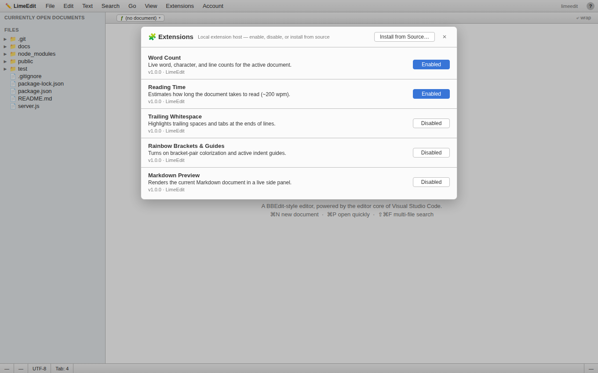
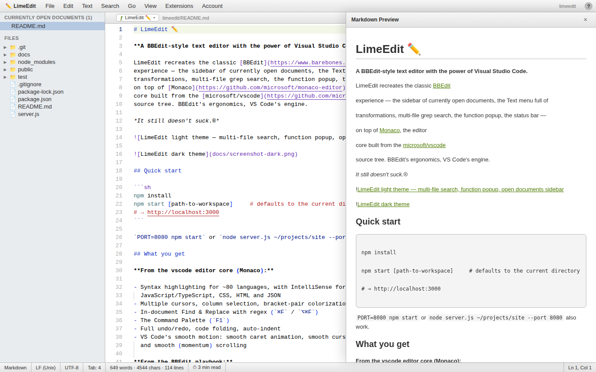

# LimeEdit ✏️

**A BBEdit-style text editor with the power of Visual Studio Code.**

LimeEdit recreates the classic [BBEdit](https://www.barebones.com/products/bbedit/)
experience — the sidebar of currently open documents, the Text menu full of
transformations, multi-file grep search, the function popup, the status bar —
on top of [Monaco](https://github.com/microsoft/monaco-editor), the editor
core built from the [microsoft/vscode](https://github.com/microsoft/vscode)
source tree. BBEdit's ergonomics, VS Code's engine.

*It still doesn't suck.®*


## Quick start

```sh
npm install
npm start [path-to-workspace]     # defaults to the current directory
# → http://localhost:3000
```

`PORT=8080 npm start` or `node server.js ~/projects/site --port 8080` also work.

## What you get

**From the vscode editor core (Monaco):**

- Syntax highlighting for ~80 languages, with IntelliSense for
  JavaScript/TypeScript, CSS, HTML and JSON
- Multiple cursors, column selection, bracket-pair colorization
- In-document Find & Replace with regex (`⌘F` / `⌥⌘F`)
- The Command Palette (`F1`)
- Full undo/redo, code folding, auto-indent
- VS Code's smooth motion: smooth caret animation, smooth cursor blink,
  and smooth (momentum) scrolling

**From the BBEdit playbook:**

| Feature | Where |
| --- | --- |
| Currently Open Documents sidebar with dirty-dots | left sidebar |
| Disk browser | left sidebar |
| Function popup (jump to function/class/heading) | navigation bar, `ƒ` |
| Multi-File Search with Grep, case & whole-word options | Search ▸ Multi-File Search… (`⇧⌘F`) |
| Change Case (UPPER / lower / Title / Sentence / tOGGLE) | Text menu |
| Sort Lines… (descending, case-sensitive, delete duplicates) | Text menu |
| Reverse Lines, Process Duplicate Lines, Delete Blank Lines | Text menu |
| Prefix/Suffix Lines…, Add/Remove Line Numbers | Text menu |
| Entab / Detab, Strip Trailing Whitespace | Text menu |
| Zap Gremlins (control & zero-width characters) | Text menu |
| Educate / Straighten Quotes | Text menu |
| Hard Wrap… | Text menu |
| Open Quickly (fuzzy file search) | `⌘P` |
| Soft-wrap toggle, Show Invisibles | View menu / navigation bar |
| Line-ending (LF/CRLF), language mode & tab-width switchers | status bar |
| Light & dark chrome | View ▸ Dark Mode |
| Smooth animations (editor + UI) | View ▸ Smooth Animations |
| Extension system with an extension host | Extensions menu (`⇧⌘X`) |
| Account / sign-in with Settings Sync | Account menu / avatar |
| Raw mode (plain text, all invisibles) | View ▸ Raw Mode |

Text transformations follow BBEdit's rule: they apply to the **selection** if
there is one, otherwise to the **entire document**, and every one of them is
undoable.

## How much of VS Code is this, really?

Honest answer: LimeEdit is built on **Monaco**, the *editor core* extracted from
`microsoft/vscode`. That gives you the genuine article for everything about
*editing text* — the same highlighter, IntelliSense, find/replace, multi-cursor,
folding, and command palette that ship in VS Code.

What Monaco does **not** include are the parts of VS Code that make it a full
IDE *product*: the integrated terminal, the debugger, the cloud Extension
Marketplace, the Git/SCM UI, and cloud accounts. Those are separate VS Code
subsystems, not part of the editor. LimeEdit provides its own local
implementations of several of them — an [extension system](#extensions), an
[account with Settings Sync](#account--settings-sync), and a
[raw mode](#raw-mode) — rather than pretend they come for free.

## Extensions

LimeEdit has a real extension host, modelled on the shape of the VS Code
extension API. It isn't the Marketplace (that's a cloud service) — it's a local
host you manage from **Extensions ▸ Manage Extensions…** (`⇧⌘X`).



Each extension has an `activate(api, context)` and an optional `deactivate()`.
The host tracks everything an extension registers during activation and tears it
all down on disable, so toggling is clean and reversible. Enabled built-ins are
remembered across sessions.

The `api` handed to an extension can:

- read the active model and react to `onActiveDocument` / `onContentChange`
- contribute **status-bar items** (`addStatusItem`)
- register **commands** — they appear in the `F1` palette as real Monaco actions
- open a **preview panel** (`showPanel`)
- persist namespaced data (`storage`)

Five extensions ship built-in:

| Extension | What it does |
| --- | --- |
| **Word Count** | Live words · characters · lines in the status bar |
| **Reading Time** | Estimated reading time (~200 wpm) |
| **Trailing Whitespace** | Highlights trailing spaces/tabs with a decoration |
| **Rainbow Brackets & Guides** | Turns on bracket-pair colorization + indent guides |
| **Markdown Preview** | Renders the current Markdown doc in a live side panel |



### Installing a raw extension

**Extensions ▸ Install from Source…** lets you paste an extension object with an
`activate(api)` function and load it on the spot — the LimeEdit analogue of
writing a VS Code extension by hand. It runs the code you paste in the page, so
only install code you trust (usually your own). A minimal example:

```js
{
  id: "my.hello",
  name: "Hello",
  activate(api) {
    const item = api.addStatusItem({ id: "hello", text: "👋 hello" });
    api.onActiveDocument(() =>
      item.update("👋 " + (api.getModel() ? "editing" : "idle"))
    );
  }
}
```

Raw extensions are session-scoped by design; built-ins persist.

## Account & Settings Sync

Click the avatar in the top-right (or **Account ▸ Sign In…**) to create a local
profile. There's no password and no cloud — it's a stored identity that gives
you an avatar and, more usefully, **Settings Sync**: your theme, animations, tab
width, and enabled extensions are saved with the profile (server-side, outside
your workspace).

Sync follows the same rule VS Code does: synced settings **seed a fresh
environment** but never clobber newer local changes — local edits win, and you
push them up with **Sync Settings Now**. Sign-in state is persisted server-side
via `/api/account`.

## Raw mode

**View ▸ Raw Mode** shows the current document as plain, unhighlighted text with
every invisible (spaces, tabs, control characters) rendered and soft-wrap off —
the raw bytes, essentially. A red **RAW** badge appears in the status bar; click
it (or toggle the menu item) to return to the document's normal language and
view. Switching languages is remembered, so leaving raw mode restores the
original highlighting.

### Smooth animations

LimeEdit brings VS Code's polished, animated feel to both layers. In the editor
that's the smooth caret glide, smooth cursor blink, and momentum scrolling from
Monaco. In the surrounding BBEdit chrome, overlays and panels animate in the way
VS Code's do: the Open Quickly palette and dialogs rise and fade, menus and the
function popup fade down from their anchor, the Multi-File Search drawer slides
up from the bottom, and hover/selection states ease rather than snap.

Toggle it all from **View ▸ Smooth Animations** (the choice is remembered), and
it automatically stands down when the operating system requests
`prefers-reduced-motion`.

## Architecture

```
server.js            Express server: static frontend, Monaco assets, a small
                     file API (tree/read/write/search/quick-open) sandboxed to
                     the workspace root, and the account/settings-sync API
public/
  index.html         Menu bar · sidebar · navigation bar · editor · status bar
  css/limeedit.css   BBEdit-style chrome, light + dark, animations
  js/app.js          Documents, menus, dialogs, search, quick open, status bar,
                     extension host wiring, account, raw mode
  js/texttools.js    The Text menu transformations
  js/functionscanner.js  Regex scanners feeding the function popup
  js/extensions.js   The extension host, built-in extensions, raw-install
```

The account and any synced settings are stored server-side under
`.limeedit-data/` (gitignored), never in your workspace; `LIMEEDIT_DATA`
overrides the location.

There is no build step. Monaco ships prebuilt in the `monaco-editor` npm
package (built from `microsoft/vscode`) and is served as-is from
`node_modules/monaco-editor/min/vs`.

## Tests

```sh
npm test
```

Boots the server against a temp workspace and exercises every API endpoint
(files, search, quick-open, and the account/settings-sync lifecycle), the
path-traversal guard, and the static Monaco and extension routes.

## License

MIT. The Monaco editor is © Microsoft, MIT-licensed, from
[microsoft/vscode](https://github.com/microsoft/vscode) /
[microsoft/monaco-editor](https://github.com/microsoft/monaco-editor).
BBEdit is a trademark of Bare Bones Software — LimeEdit is an affectionate
homage, not an affiliation.
